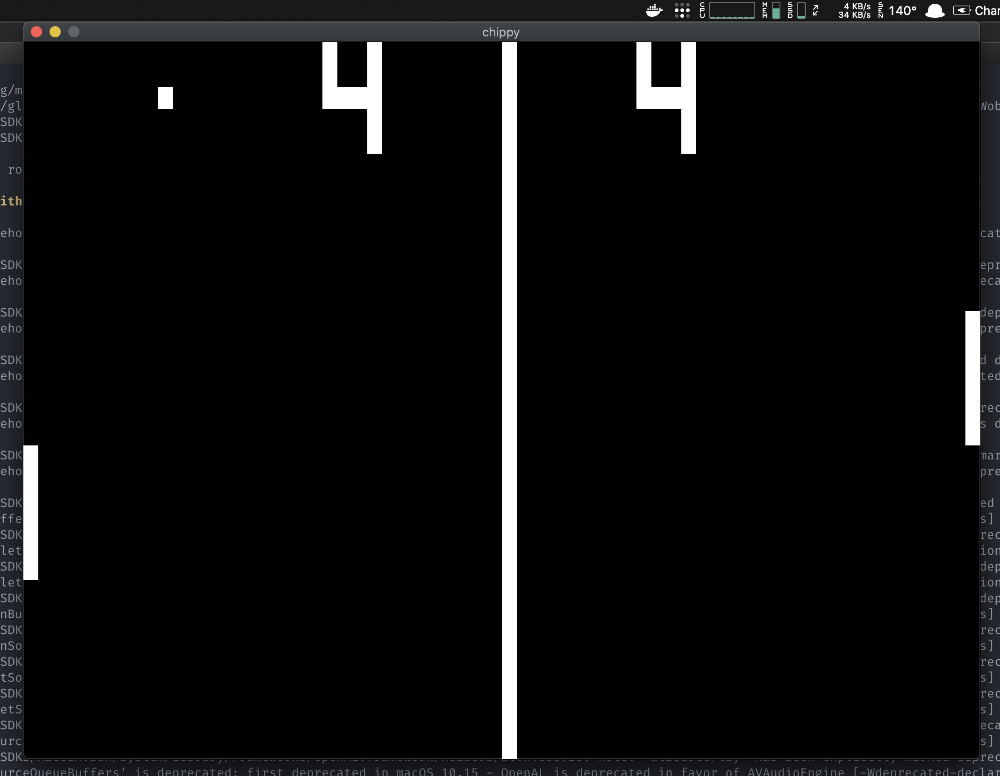
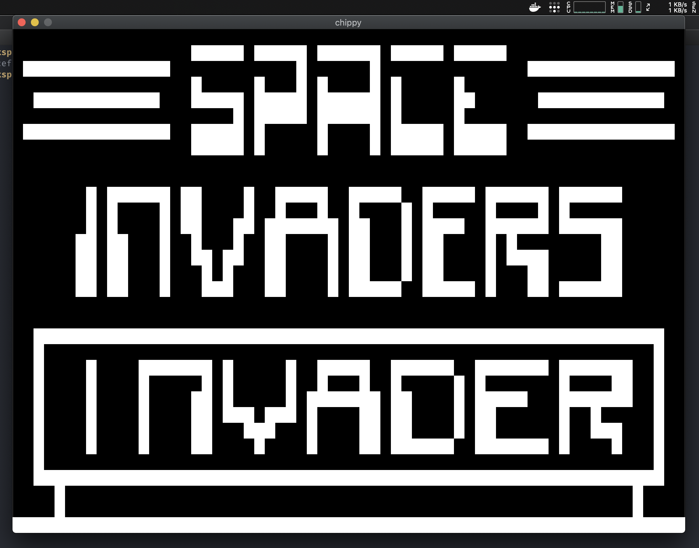
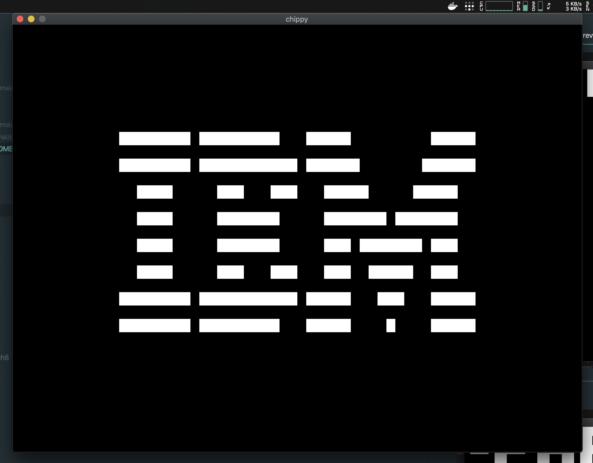

  

<h1 align="center">Welcome to Chippy 👋</h1>

  
  
  

Chippy is a [CHIP-8](https://en.wikipedia.org/wiki/CHIP-8) emulator that runs Chip-8 public domain roms. The Chip 8 actually never was a real system, but more like a virtual machine (VM) developed in the 70’s by Joseph Weisbecker. Games written in the Chip 8 language could easily run on systems that had a Chip 8 interpreter.

> Audio beeps currently not working

Current sources:
- [post by Laurence Muller](http://www.multigesture.net/articles/how-to-write-an-emulator-chip-8-interpreter)
- [CHIP-8 Wiki](https://en.wikipedia.org/wiki/CHIP-8)
- [cowgod's chip-8 technical reference](http://devernay.free.fr/hacks/chip8/C8TECH10.HTM)
- [chip-8 instruction set](http://www.multigesture.net/wp-content/uploads/mirror/goldroad/chip8_instruction_set.shtml)
- [post by Matthew Mikolay](http://mattmik.com/files/chip8/mastering/chip8.html)

---

Pong

---

Space Invaders

---

IBM Logo

